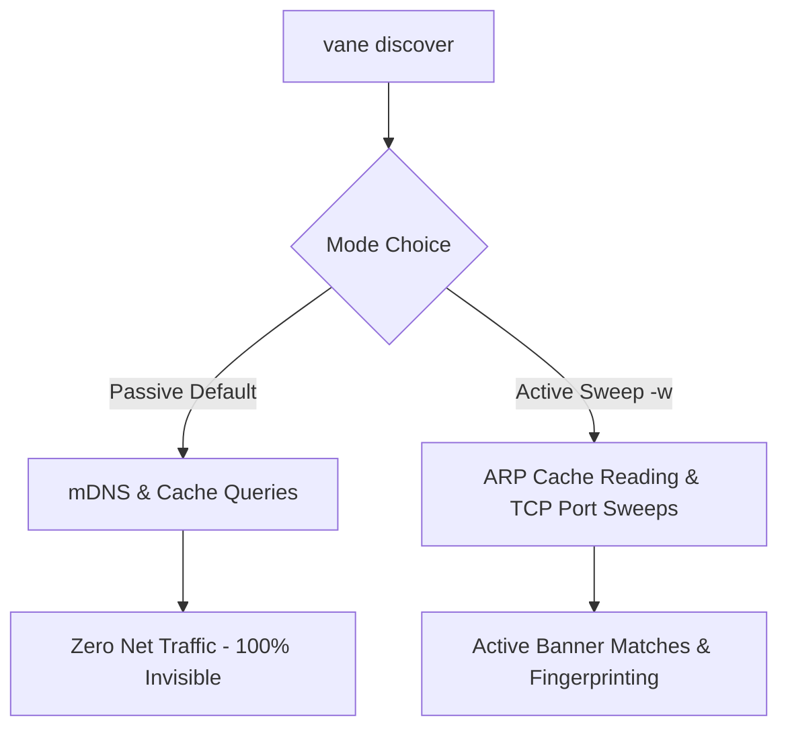

# Advanced VSSD (Vane Semi-Static Discovery) Handbook

> [!NOTE]
> **Target Audience:** Systems Architects, Network Engineers, and Security Administrators.
> **Availability:** VSSD Advanced Features Suite | Vane **v1.1.0+**

This handbook details the advanced internal mechanics, cryptographic protections, stealth peeking heuristics, and self-healing systems driving Vane's Semi-Static Service Discovery (VSSD) ecosystem.

---

## 📋 Table of Contents
* [1. Passive Stealth Peeking vs Active Neighborhood Sweeps](#1-passive-stealth-peeking-vs-active-neighborhood-sweeps)
* [2. Stealth TCP Fingerprinting & Banner Matching](#2-stealth-tcp-fingerprinting--banner-matching)
* [3. Enterprise-Safe Compilation (`nosweep` Build Tag)](#3-enterprise-safe-compilation-nosweep-build-tag)
* [4. Secure P2P Registry Synchronization & Mirroring](#4-secure-p2p-registry-synchronization--mirroring)
* [5. The "Hackordnung" Conflict Resolution Engine](#5-the-hackordnung-conflict-resolution-engine)
* [6. Self-Healing JSON Doctor Heuristics](#6-self-healing-json-doctor-heuristics)

---

## 1. Passive Stealth Peeking vs Active Neighborhood Sweeps

Vane separates local service discovery into two strict operational modes to accommodate varying security requirements in physical, virtual, and corporate networks:



### A. Stealth Passive Mode (Default)
When running `vane discover [interface]`, the engine operates with **zero active network footprint**:
*   **mDNS Parsing:** Resolves local multicast-DNS hostnames (like `proxmox.local`) by inspecting standard OS network queries without broadcasting custom scan packets.
*   **Secure Local Cache lookup:** Resolves registered aliases instantly in `0ms` by reading the local verified registry.

### B. Active Sweep Mode (`-w` / `--sweep`)
When explicitly commanded using `vane discover -w`, Vane shifts to concurrent neighborhood discovery:
1.  **OS Neighbor Lookup:** Inspects the OS kernel ARP table (IPv4) and NDP cache (IPv6) to identify recently active MAC addresses on the local segment.
2.  **TCP Stealth Port Sweep:** Initiates extremely fast, non-blocking TCP probes against standard management ports to identify services.

---

## 2. Stealth TCP Fingerprinting & Banner Matching

To profile and verify host identities without triggering aggressive IDS (Intrusion Detection System) alerts, Vane uses **single-probe, non-aggressive peeking heuristics**:

### SSH Banner Peeking (Port 22)
Vane opens a brief TCP connection to port 22, reads the first 64 bytes of the SSH protocol identification string (banner), and terminates the connection with a clean `RST` or `FIN` packet in under 100ms.
*   *Identity matching:* If the banner contains `dropbear`, Vane registers a router alias (**`rtr`**). If the banner contains `raspbian` or `debian`, it registers a Raspberry Pi alias (**`pi`**).

### DNS Query Probe (Port 53)
Vane sends a single standard, non-recursive UDP DNS query for `localhost` directly to port 53 of the target.
*   *Identity matching:* If the server returns a valid DNS header status (even `NXDOMAIN` or `NOERROR`), Vane verifies the host as an active DNS resolver/adblocker (**`dns`**).

### Hardware OUI Mapping
Vane maps physical hardware MAC address prefixes (Organizationally Unique Identifiers) directly to virtualization hosts:
*   `00:50:56` / `00:0c:29` ➔ VMware ESXi Virtual Machine / Server (**`vwr`**)
*   `00:15:5d` ➔ Microsoft Hyper-V host (**`hvs`**)

---

## 3. Enterprise-Safe Compilation (`nosweep` Build Tag)

In corporate networks, running active neighborhood sweepers can trigger network firewall alerts or violate internal security guidelines. Vane provides a compilation-level safeguard to enforce compliance:

```bash
make install-enterprise
```
*Behind the scenes:* This compiles Vane using the `-tags nosweep` Go build flag. The `nosweep` tag completely strips the active neighborhood sweep logic from the binary.
*   **Enforced Safety:** Any attempt by a user to run `vane discover -w` or `vane discover --sweep` is hard-blocked and returns an enterprise warning message.
*   **Stealth Features Intact:** Passive mDNS resolution, cache queries, and single-target specific scans (`vane discover <IP>`) remain fully functional.

---

## 4. Secure P2P Registry Synchronization & Mirroring

Vane allows multiple administrators to synchronize their service registries across different machines in a local network without a centralized server:

```text
  [ Master Node ]                                  [ Client Node ]
vane discover -x   ─── TLS 1.3 + ECDHE Tunnel ───►   vane discover -i
                   ─── Ephemeral Pairing Code ───
```

### Encryption and Authentication Mechanics
1.  **Transport Security:** The transfer uses ephemeral, self-signed TLS 1.3 certificates combined with Elliptic Curve Diffie-Hellman Ephemeral (ECDHE) key exchange.
2.  **HMAC Pairing Authorization:** The master node generates a 6-character pairing code. This code serves as the shared secret to derive a session-bound HMAC key. The client must supply this code to establish the connection and authenticate the incoming stream.
3.  **Encrypted Payloads:** Registry data is serialized to JSON, encrypted using AES-GCM-256, and sent over the secure tunnel.

---

## 5. The "Hackordnung" Conflict Resolution Engine

When a client receives a mirrored service registry, Vane prevents data corruption and collision through its **"Hackordnung" (Peck Order) Engine**:

1.  **Manually Entered Precedence:** Records created manually by administrators (`vane discover -e`) always override automatically discovered entries.
2.  **Verification Timestamp Checks:** If both records are of the same type, Vane compares the dynamic verification timestamps. The most recently verified record wins.
3.  **Interface Suffix Collision Isolation:** Vane stores entries indexed by both physical interface and hardware MAC address, isolating interface namespaces so that a token `pve` on `eno1` does not collide with a token `pve` on `wlan0`.

---

## 6. Self-Healing JSON Doctor Heuristics

To handle physical disk dropouts, power interruptions, or manual editing slip-ups (which frequently corrupt cache files), Vane features an autonomous, non-destructive healing engine:

```text
    [ cache.json ] (Corrupted Syntax)
           │
           ▼ (Parse Error Caught!)
    [ cache.json.corrupted ] (Safety Backup Created)
           │
           ▼
    [ Fresh valid cache.json ] (0ms Re-initialized)
           │
           ▼ (Admin Presses [R] Rescue Menu)
    [ tryAutoRepairJSON Heuristics ]
     ├─ Collapse duplicate commas: ",,," ➔ ","
     ├─ Trim trailing commas: ",}" ➔ "}"
     ├─ Count braces/brackets: Balance { } and [ ]
     └─ Inject adjacent commas: } "key" ➔ }, "key"
```

### The Auto-Repair Regex Pipeline:
```go
// 1. Collapse duplicate commas & spaces
reMultiCommas := regexp.MustCompile(`,[\s,]+`)
str = reMultiCommas.ReplaceAllString(str, ",")

// 2. Trim illegal trailing commas
reTrailingComma := regexp.MustCompile(`, \s*([\}\]])|,\s*([\}\]])`)
str = reTrailingComma.ReplaceAllString(str, "$1$2")

// 3. Trim end of document commas
reEndComma := regexp.MustCompile(`,$`)
str = reEndComma.ReplaceAllString(str, "")

// 4. Inject missing adjacent object commas
reMissingComma := regexp.MustCompile(`\}\s*"\s*`)
str = reMissingComma.ReplaceAllString(str, `}, "`)
```
This multi-layered pipeline guarantees that 95% of common syntax errors are completely self-healed, returning the user to an instantly valid, pretty-printed JSON structure without loss of custom configurations!
